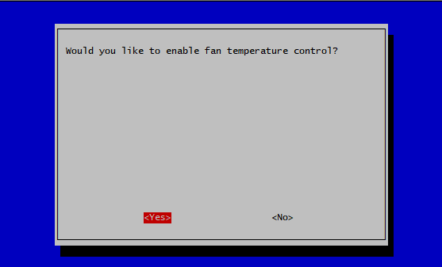
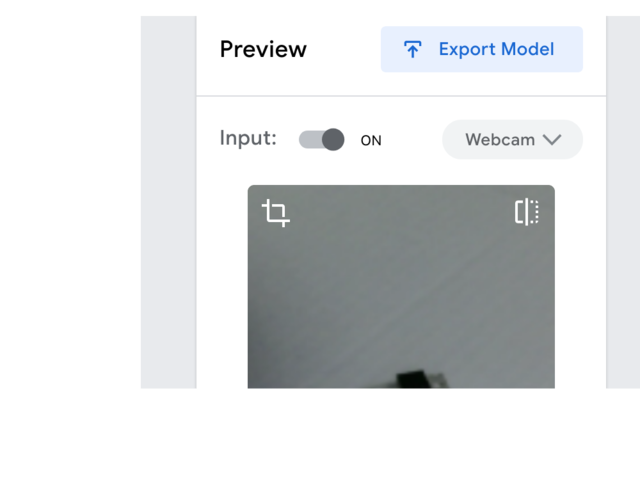
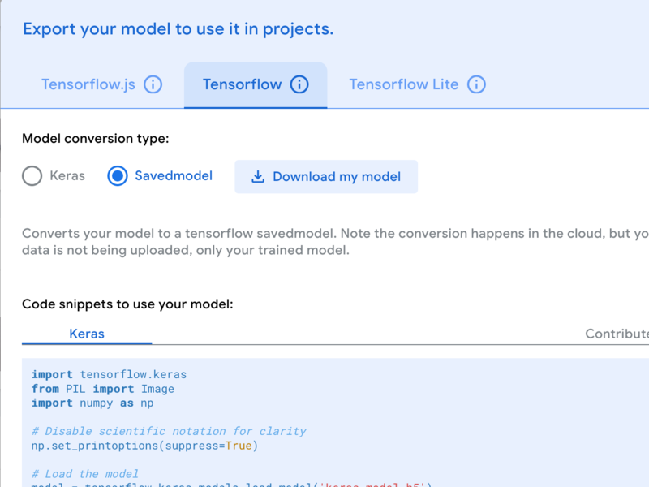

# Using Machine Learning and Cameras on the Edge for Conservation and Sustainability


### This tutorial is a step step instruction manual on how to:
1. Set up a network to connect your computer to a Raspberry pi,
2. Connecting a Camera to your Raspberry Pi
3. Connect a Raspberry Pi (a single board computer) to a BrainCraft Hat (a microprocessor that adds a screen, audio, and microphone to your raspberry Pi) and a fan (for cooling it down when it’s overthinking)
4. Configuring Raspberry Pi to do Machine Learning
5. Adding a simple AI model using teachable machine to your raspberry PI for you to use in your conservation technology projects.

### Important Notes:
* Most of this tutorial has been copied from a sources around the internet and aggregated into a cohesive guide. We've done our best to link to these sources, but if you notice we've missed something, please help us fix that
* This tutorial is written for Linux based operating systems (macOS specifically). This process should mostly work with Windows OS, but there will be some extra googling to get everything set up. Feel free to submit a Windows based version or edits that would make it operating system agnostic if you feel so inclined.
* Whenever you see text within triangle brackets, this is placeholder text. Make sure to replace the placeholder text and brackets with the right information. For instance `<Favorite_Animal>` would be `tiger`
* In the bash commands we share with you, the `$` signifies the beginning of a line. You do not need to paste this part of the command into your terminal.


## 1. Materials Needed

1x needed per team:
* [Raspberry Pi 4 B ](https://www.adafruit.com/product/4296) (minimum 4gb RAM)
* [Raspberry Pi Camera Board](https://www.adafruit.com/product/3099)
* [Camera extension cable](https://www.adafruit.com/product/1731)
* [BrainCraft Hat](https://www.adafruit.com/product/4374)
* [Power supply compatible with Raspberry Pi 4](https://www.adafruit.com/product/4298)
* [microSD card with adapter 16 GB](https://www.adafruit.com/product/2693)
* [Micro SD Card Reader](https://www.adafruit.com/product/939) (optional)
* [USB C to USB A Adapter](https://www.adafruit.com/product/5030) (optional)
* [Raspberry Pi Case](https://www.adafruit.com/product/4301)
* [Camera Case](https://www.adafruit.com/product/3253)
* [Tripod](https://www.amazon.com/dp/B08C53F6CD) (optional)


## 2. Setting up a Network Between your Computer and a Raspberry PI

_Goal: In this section we are installing an operating system on our Raspberry Pi, connecting to our internet network, and making sure that our laptop can easily communicate with the Raspberry Pi._

**Required Equipment:**
* Computer
* MicroSD card 16GB
* Adaptor for microSD to your computer (usb-C port)
* [Raspberry Pi 4](https://www.adafruit.com/product/4296)


### 2.1 Installing an Operating System on your Raspberry PI


* Take your SD card out of the package, or use one that you have close by but make sure that it’s empty because we’re going to completely overwrite it. Connect your SD card to your computer using your microSD adapter for USB-C (if you’re using a newer Mac).
* Visit [this link](https://www.raspberrypi.org/software/) and click on the “Download for MacOs” button and go through the steps to install on your computer. If the install is successful you should be able to see this:

* Choose the latest operating system.
* To make sure that you are mounting the image of this operating system on your RasperyPi(not your computer - THE SD CARD), plug and unplug the SD card so that you can see it appear and disappear on the storage section of the Raspberry Pi Imager. That way you’ll make sure that you are installing the operating system in the correct place.
* Click “WRITE” - this will install the latest operating system on your SD card.


### 2.2 Adding Network Information on SD Card and Operating System

Sources and links to learn more:

1. [More info on the files your adding to connect via wifi](https://learn.adafruit.com/raspberry-pi-zero-creation/text-file-editing)
2. [More info on how to connect to your Pi without a screen](https://spin.atomicobject.com/2019/06/09/raspberry-pi-laptop-display/)

Follow the instructions in the first link above. We paste some code below to support the text in that link, which should be mostly what you need. Right now you are not doing anything on your Raspberry PI _yet_. You are adding and making changes to files inside the SD card so that you can connect to the internet. After we’ve done that we’ll move the SD card to the Raspberry Pi.

First lets access the places in the SD that we’ll edit


```bash
$ cd /Volumes
#we're going to choose the boot partition. You can tell which one it is, because if plug and unplug your SD card the boot inside /Volumes should appear and disappear
$ cd /boot
```


Now we create the `wpa_supplicant.conf` file that is mentioned in the link. We use this using “touch”r


```bash
$ touch wpa_supplicant.conf
$ ls
#we use ls to list out the files inside a folder. The conf file should now appear in your list of files
```


One we see the file we’re going to edit, the `wpa_supplicant.conf` file in this case, with the information of our network. We do this by going in the SD card and either using “vim” or “nano” to edit the file you just created. Below we use nano to open the file:


```bash
$ nano wpa_supplicant.conf
```


Copy and paste this code into that file, and edit it with the information of your network. Don’t forget to save the file after you close it!


```bash
ctrl_interface=DIR=/var/run/wpa_supplicant GROUP=netdev
update_config=1
country=US

network={
    ssid="YOURSSID"
    psk="YOURPASSWORD"
    scan_ssid=1
}
```


Note that there are no spaces in between the “=”. If you’re outside of the US change your country code.

Finally, enable SSH by creating an empty file named ssh (this will just be an empty file for now):


```bash
$ touch ssh
```


Check that all your files are there. The important ones are the wpa_supplicant and the ssh files, and then _safely remove the SD card from your computer (don’t just unplug it)._


### 2.3 Connecting your Raspberry Pi to the Internet

_NOTE: In a classroom with many students we must turn the Pis one by one and see their different IP addresses._

**Required Downloads:**


* [Visit the nmap install page here](https://nmap.org/download.html)

Install nmap on your computer. nmap is a network sniffing tool for understanding network traffic. The goal is to identify the IP address of our raspberry PI.


1. First identify your own IP address. You can do this by holding on the “option” button on your Mac keyboard while clicking on the “wifi” button on your top menu. Write down the IP address that your computer is using. The first time you run nmap from your terminal make sure you do it without turning on your PI.

```bash
nmap -sP <YOUR_IP_ADDRESS>/24
nmap -sP 192.168.1.79/24
```


2. Now that you’ve seen the IP addresses that are in your network, turn on your PI and see if there is _a new IP address. _The new IP address will be the IP address that your PI is using. Note, if you don’t see a new IP address you might have to plug the SD card back on your computer and make sure that you’ve done all the steps in the previous section correctly. Once you identify it you’re going to want to ssh into it from your Mac’s terminal:

```bash
ssh pi@<YOURIPNETWORK>
ssh pi@192.168.1.90
```


3. If you don’t find your raspberry address here, or if it doesn’t work do:

```bash
ssh pi@raspberrypi.local
```

4. Say "yes" and connect to the pi using the default password “raspberry”. If you are able to ssh then you’re connected to the internet!
5. Before you move forward, if this works, ping this ip address.

```bash
ping raspberrypi.local
```


6. Copy and paste the IP address.
7. Say “yes” and connect to the pi using the default password “raspberry”. If you are able to ssh then you’re connected to the internet!
8. From the terminal (once you’ve sshd in), change your PI’s password by using the instructions [here](https://www.raspberrypi-spy.co.uk/2012/10/how-to-change-raspberry-pi-password/).
9. ALSO change your hostname (this is specially important if you’re working with a group of students that’s using many raspberry pis).
10. [Follow this guide to change hostname](https://www.tomshardware.com/how-to/raspberry-pi-change-hostname)
11. Write down your PI’s **IP address** AND **your new password** somewhere safe, we’re going to use them later on in the tutorial.


### 2.4 Seeing and Controlling your Raspberry Pi’s Desktop through your Laptop

**Useful links:**
* [https://spin.atomicobject.com/2019/06/09/raspberry-pi-laptop-display](https://spin.atomicobject.com/2019/06/09/raspberry-pi-laptop-display)
* [https://magpi.raspberrypi.org/articles/vnc-raspberry-pi ](https://magpi.raspberrypi.org/articles/vnc-raspberry-pi )


[Once you’ve ssh'd into your Pi install VNC on your Pi by following the steps here. ](https://www.raspberrypi.org/documentation/remote-access/vnc/)

```bash
pi@hostname:~ $ sudo apt update
pi@hostname:~ $ sudo apt install realvnc-vnc-server realvnc-vnc-viewer
```


After installing the VNC server, you have to enable it.


```bash
pi@hostname:~ $ sudo raspi-config
```

A pop-up will appear → navigate to “Interface/ing Options” → navigate to “P3 VNC” → Select “Yes” → navigate down and select “Finish”.

Now we install VNC on our computer by [downloading it from here](https://www.realvnc.com/en/connect/download/viewer/).

To connect to your Raspberry Pi’s desktop launch the VNC viewer and type down the IP address of your PI as the VNC server address. Use username “pi” and the password you changed above. You initially might have some trouble connecting and you’ll get an error that might say `Cannot Currently Show the Desktop`. If so, follow the first instruction [here](https://www.tomshardware.com/how-to/fix-cannot-currently-show-desktop-error-raspberry-pi ) on how to change the resolution of the desktop. Try again. If it works … hooray! If not, keep trying until you figure out what the problem is. Awesome! We’re ready to begin the actual fun part.


## 3. Setting Up The Camera
_[Most of this section is sourced from this guide](https://projects.raspberrypi.org/en/projects/getting-started-with-picamera)_

### Introduction

This section will walk through how to connect the Raspberry Pi Camera Module to your Raspberry Pi to take pictures and record video. Raspberry Pi’s have a port dedicated to connecting the camera module.

Before plugging in or unplugging anything always ensure your Raspberry Pi is off and disconnected from power.


### Connect the Camera:


1. Ensure Pi is turned off
2. Locate the Camera Module port
3. Gently pull up on the edges of the port’s plastic clip
4. Insert the Camera Module ribbon cable; make sure the blue side of the cable is facing the ethernet ports.
5. Push the black plastic clip back into place firmly, but make sure you’re pressing it down vertically.
6. Place the Camera board into the protective plastic case.


### Enabling, Testing, and Troubleshooting


1. Startup your Raspberry Pi.
2. Connect with VNC Viewer as detailed previously
3. Go to the main menu > Preferences > Raspberry Pi Configuration tool
4. Select the Interfaces tab and ensure that the camera is enabled
5. Reboot your Raspberry Pi by going to main menu > Logout > Reboot

Once the Pi has rebooted, reconnect using VNC Viewer. Open up a terminal window using VNC Viewer and type this command that should take a still picture and save it to the Desktop.


```bash
raspistill -o Desktop/image.jpg
```


If you see an image appear on your Pi Desktop it means that your camera is connected correctly. Congratulations!

If you receive the following error it means that your camera is not connected properly.


```bash
$ raspistill -o Desktop/image.jpg
mmal: Cannot read camera info, keeping the defaults for OV5647
mmal: mmal_vc_component_create: failed to create component 'vc.ril.camera' (1:ENOMEM)
mmal: mmal_component_create_core: could not create component 'vc.ril.camera' (1)
mmal: Failed to create camera component
mmal: main: Failed to create camera component
mmal: Camera is not detected. Please check carefully the camera module is installed correctly
```


To trouble shoot, shutdown your Raspberry Pi, unplug the camera, and reconnect. Ensure it is facing the right direction, it is seated at the bottom of the connective housing, it is not crooked, and the black clip is pushed all the way down.

Also double check on the camera board that the small ribbon cable below the lens is connected to the board evenly. Do not attempt to unplug if it is already connected. This is a very delicate connector and should be treated with the utmost care.

After following these troubleshooting steps, plug in your Raspberry Pi and try to run the command above to take a photo again. The camera connection can be finicky, it may take a couple tries to get it connected the right way.


## 4. Connecting and Configuring Braincraft HAT


### Introduction

*Most of this section is sourced [from this page](https://learn.adafruit.com/adafruit-braincraft-hat-easy-machine-learning-for-raspberry-pi/overview). Visit this tutorial for more info and additional direction.*

The idea behind the Adafruit BrainCraft HAT is that you’d be able to “craft brains” for Machine Learning on the EDGE (Edge is  a way to refer to small computers like phones or other smaller hardware), with Microcontrollers & Microcomputers. This HAT will let you build a wide range of audio/video AI projects while also allowing easy plug-in of sensors and robotics!

As a part of this section we will also connect the controllable mini fan to the bottom of the hat to keep your Pi cool while doing intense AI inference calculations. Most importantly, there’s an On/Off switch that will completely disable the audio codec, so that when it's off, there’s no way it's listening to you.

We’re not going to go in depth on each component, [but if you want to learn more about the board and its pinouts, check this out.](https://learn.adafruit.com/adafruit-braincraft-hat-easy-machine-learning-for-raspberry-pi/pinouts) The basic features are as follows:


* 1.54" IPS TFT display with 240x240 resolution that can show text or video
* Stereo speaker ports for audio playback - either text-to-speech, alerts or for creating a voice assistant.
* Stereo headphone out for audio playback through a stereo system, headphones, or powered speakers.
* Stereo microphone input - perfect for making your very own smart home assistants
* Two 3-pin JST STEMMA connectors that can be used to connect more buttons, a relay, or even some NeoPixels!
* STEMMA QT plug-and-play I2C port, can be used with any I2C STEMMA QT boards, or can be used to connect to Grove I2C devices with an adapter cable.
* 5-Way Joystick + Button for user interface and control.
* Three RGB DotStar LEDs for colorful LED feedback.


### Braincraft HAT Hardware Install

You will install the Braincraft HAT in two parts, the first is connecting the fan and then you will connect the HAT itself.


#### Fan

Carefully position your Braincraft HAT screen side down. Take your fan from its packaging and connect the wires into the small connector that says FAN: P4. The Red wire should face the large black plastic connector. Once this is connected, take off the orange hole protector stickers from the board and position your fan on the middle of the board aligning the holes. Position the wire so it is not pinched under the fan, and carefully attach the screws firmly, but not too tight. You should be using the screws that _do not_ come with the small nuts (don’t use the nuts).


#### Braincraft HAT

Flip the board fan side down and carefully press the rubber joystick cover over the small joystick to the right of the screen. Once you have done this, carefully align the hat’s plastic connector over the pins on your board so the hat is covering the majority of the Raspberry Pi. Firmly press down to make sure the components are connected. Congratulations, your Braincraft board and fan are installed!


### Blinka Setup

Blinka is a CircuitPython (python meant to be run on microcontrollers) library compatibility layer. It allows many of the libraries that were written for CircuitPython to run on CPython for Linux. To learn more about Blinka, you can check out the [CircuitPython on Linux and Raspberry Pi](https://learn.adafruit.com/circuitpython-on-raspberrypi-linux) guide. We will need to install it to get the Braincraft Components up and running.

SSH into your Raspberry Pi or access via VNC viewer and open a terminal. Execute the following series of commands.


```bash
pip3 install setuptools --upgrade
```


Next input the following commands. Note these are several commands that will run one after another. When it asks you if you want to reboot, choose yes.


```bash
cd ~
sudo pip3 install --upgrade adafruit-python-shell
wget https://raw.githubusercontent.com/adafruit/Raspberry-Pi-Installer-Scripts/master/raspi-blinka.py
sudo python3 raspi-blinka.py
```


Once it reboots, there are a couple CircuitPython libraries to install for the BrainCraft HAT.

The DotStar library is for controlling the 3 on-board DotStar LEDs and the Motor library is for testing out the GPIO pins. Install it using pip using the command below.


```bash
pip3 install --upgrade adafruit-circuitpython-dotstar adafruit-circuitpython-motor adafruit-circuitpython-bmp280
```


### Fan Service Setup

There is a really simple fan service that will control the onboard fan you just installed. The reason we have it set up as a service instead of keeping the fan on all the time is so that it doesn't drain too much power from the Pi during the initial power on.

The fan service basically controls turning GPIO 4 on at startup, which is what the fan is connected to. Installing the fan service is really simple and we have a script for doing that.

To install, ssh in or access using VNC Viewer and open a terminal window. Input the following command:


```bash
sudo raspi-config
```


Select Performance Options


Select Fan


Select Yes




And make sure you put down GPIO pin 4 for the fan


You can customize the fan temperature setting. **For testing, put it on 60.**


To see if it’s connected correctly, run a stress test. The following command will stress test the CPU causing the Pi to heat up. The fan should turn on at 60 degrees C.


```bash
sudo apt-get install stress
while true; do vcgencmd measure_clock arm; vcgencmd measure_temp; sleep 10; done& stress -c 4 -t 900s
```


If the fan works as expected, reboot your pi using `sudo reboot` to end the stress test. When it is rebooted follow the instructions above and switch the temperature to 80 degrees.

If the fan does not switch on as expected, try reconnecting the wire.


### Display Module Setup

For some purposes you can setup the display using pure Python, which is probably easier, but for our purposes we will need to install using a kernel module. [You can learn more about kernel modules here if you want.](https://en.wikipedia.org/wiki/Loadable_kernel_module)

To setup run the following script while you are ssh’d in or on a terminal opened through VNC Viewer.


```bash
cd ~
sudo pip3 install --upgrade adafruit-python-shell click
sudo apt-get install -y git
git clone https://github.com/adafruit/Raspberry-Pi-Installer-Scripts.git
cd Raspberry-Pi-Installer-Scripts
sudo python3 adafruit-pitft.py --display=st7789_240x240 --rotation=0 --install-type=fbcp
```


When you are asked to reboot, reboot.

If your display module has a bunch of lines running through it, [check out this page to troubleshoot. ](https://learn.adafruit.com/adafruit-braincraft-hat-easy-machine-learning-for-raspberry-pi/kernel-module-troubleshooting)

Test out your camera by running:


```bash
sudo pip3 install picamera
raspistill -t 0
```


If it is working you should see what the camera is viewing on your display.


### Interacting with your Camera and BrainCraft HAT using Python

At this point, you should have just about everything already set up.

Besides the display, audio, and fan, this board has quite a few other useful features on it that can be controlled through Python. We'll go through those and how to control them in Python.


#### Joystick and Button test

The 5-way Joystick and button uses digitalio and each uses a separate GPIO, so they're really simple to control. Here's a script that will setup the GPIOs, Create Internal Pullups, and then print out the value to the terminal.

What you want to do is create a new python file and paste this script into the file. To do this we use nano, which is a simple text editor that you can access through your terminal. To create a new file you input `nano filename` which will then pull up an empty file with the name you chose. In a terminal access your Pi via ssh, and input the following:


```bash
nano button_test.py
```


Paste the following script into the file and save and exit using the commands listed in the terminal.


```python3
import time
import board
from digitalio import DigitalInOut, Direction, Pull

BUTTON_PIN = board.D17
JOYDOWN_PIN = board.D27
JOYLEFT_PIN = board.D22
JOYUP_PIN = board.D23
JOYRIGHT_PIN = board.D24
JOYSELECT_PIN = board.D16

buttons = [BUTTON_PIN, JOYUP_PIN, JOYDOWN_PIN,
           JOYLEFT_PIN, JOYRIGHT_PIN, JOYSELECT_PIN]
for i,pin in enumerate(buttons):
  buttons[i] = DigitalInOut(pin)
  buttons[i].direction = Direction.INPUT
  buttons[i].pull = Pull.UP
button, joyup, joydown, joyleft, joyright, joyselect = buttons

while True:
  if not button.value:
    print("Button pressed")
  if not joyup.value:
    print("Joystick up")
  if not joydown.value:
    print("Joystick down")
  if not joyleft.value:
    print("Joystick left")
  if not joyright.value:
    print("Joystick right")
  if not joyselect.value:
    print("Joystick select")

  time.sleep(0.01)
```


Once you have done this run this Python file using


```bash
python button_test.py
```


Now try moving the joystick and press the button and you should see it print out what you're pressing.


#### DotStar LEDs Test

Using the same method explained above, save this script as `dotstar_test.py`


```python
import time
import board
import adafruit_dotstar

DOTSTAR_DATA = board.D5
DOTSTAR_CLOCK = board.D6

dots = adafruit_dotstar.DotStar(DOTSTAR_CLOCK, DOTSTAR_DATA, 3, brightness=0.2)

def wheel(pos):
    # Input a value 0 to 255 to get a color value.
    # The colours are a transition r - g - b - back to r.
    if pos < 0 or pos > 255:
        return (0, 0, 0)
    if pos < 85:
        return (255 - pos * 3, pos * 3, 0)
    if pos < 170:
        pos -= 85
        return (0, 255 - pos * 3, pos * 3)
    pos -= 170
    return (pos * 3, 0, 255 - pos * 3)

while True:
    for j in range(255):
        for i in range(3):
            rc_index = (i * 256 // 3) + j * 5
            dots[i] = wheel(rc_index & 255)
        dots.show()
        time.sleep(0.01)
```


Run by entering


```bash
python dotstar_test.py
```


The DotStar LEDs should start color-cycling in a rainbow.


## 5. Tensorflow Setup

[You can access the tutorial most of this was copied from here](https://learn.adafruit.com/running-tensorflow-lite-on-the-raspberry-pi-4/tensorflow-lite-2-setup)

_NOTE:_
* _You might have to run this two times before getting the setup right._
* _You should run all these commands while ssh’d into your Raspberry Pi’s terminal. Or using_

There are a few packages that TensorFlow requires that need to be installed. Install these on your Pi by running:


```bash
sudo apt-get install -y libatlas-base-dev libhdf5-dev libc-ares-dev libeigen3-dev build-essential libsdl-ttf2.0-0 python-pygame festival python3-h5py
```


Now you have to create a virtual environment. There are a few dependency requirements to install TensorFlow inside the Python Environment:


```bash
pip3 install virtualenv Pillow numpy pygame
```


Now we must install `rpi-vision`. To do this, install the Adafruit fork of a program originally written by Leigh Johnson that uses the MobileNet V2 model to detect objects. This part will take a few minutes to complete.


```bash
cd ~
git clone --depth 1 https://github.com/adafruit/rpi-vision.git
cd rpi-vision
python3 -m virtualenv -p $(which python3) .venv
source .venv/bin/activate
```


Install TensorFlow 2.x. You should now be inside a virtual environment. You can tell by the (.venv) on the left side of the command prompt. While in the virtual environment, you may download and install Tensorflow 2.3.1


```bash
wget https://raw.githubusercontent.com/PINTO0309/Tensorflow-bin/main/previous_versions/download_tensorflow-2.3.1-cp37-none-linux_armv7l.sh

chmod a+x ./download_tensorflow-2.3.1-cp37-none-linux_armv7l.sh

./download_tensorflow-2.3.1-cp37-none-linux_armv7l.sh

pip3 install --upgrade setuptools

```


```bash
pip3 install ./tensorflow-2.3.1-cp37-none-linux_armv7l.whl
pip3 install -e .
```


After this, go ahead and reboot the Pi.


```bash
sudo reboot
```


*** AFTER REBOOT MAKE SURE YOU GET INTO THE PI AGAIN ***

Running the Graphic Labeling Demo. Finally you are ready to run the detection software. First you want to run as **root** so that Python can access the Frame Buffer of the display.


```bash
sudo bash
```


Then activate the virtual environment again:


```bash
cd rpi-vision && . .venv/bin/activate
```


To run a program that will display the object it sees on screen type in the following:


```bash
python3 tests/pitft_labeled_output.py --tflite
```


You should see a bunch of text scrolling in your SSH window.


Now start holding up various items in front of the camera and it should display what it thinks it sees, which isn't actually what the item may be. Some items that it's pretty good about identifying are coffee mugs and animals.


## 6. Adding a simple machine learning model to your raspberry PI for you to use in your conservation technology projects.

**Useful Links:**

[Google TeachableMachine](https://teachablemachine.withgoogle.com/train)

We’re going to use Teachable Machine to train and use a machine learning model for conservation technology projects. Teachable machine is a web-based tool that makes creating machine learning models fast, easy and accessible to everyone. It’s for educators, artists, students, innovators, makers of all kinds. **No prerequisite machine learning knowledge or experience is required. **

First we’re going to train our ML model. To do so, visit [TeachableMachine](https://teachablemachine.withgoogle.com/train)

Choose:


* Image project → Standard Image model

You can either use your webcam or upload pictures to train your ML model. Our suggestion is to start with an easy model first so that you can get a feel for it. Our suggestion is to begin by creating three classes. In the example below:


* Class 1: I grabbed about 10 water bottles that I had at home and I took over 300 samples (just clicking and holding the button), Class 2: I grabbed other things that were not water bottles and took pictures of them, and Class 3: I took pictures of empty backgrounds. Having 3 classes allows the ML to “train” using bottles, other objects and empty backgrounds. You can pass many more classes to be more specific. The more specific you are with the photos (data) you’re passing, the more specific your ML model will be as well.
* Hints:
    * As you take (or choose) pictures make sure you do so with different backgrounds. Changes in light and changes in background -while maintaining the focus on the object that you’re labeling fixed -  will allow us to have better training data.

After you’ve created your classes, click on “Training”. It’ll take a little bit for the model to train. After that’s completed, click on “Export Mode” and follow [the instructions here.](https://learn.adafruit.com/teachable-machine-raspberry-pi-tensorflow-camera/transferring-to-the-pi)

The first step is to export your shiny new model in **SavedModel** format. This makes it easy to transfer all of the files needed to the Pi, since it comes in a zip file.

In the dialog that appears, choose **TensorFlow** and be sure the **SavedModel** button is selected, as shown below. Then, click **Download my model**. After a minute or two, your browser will save a `converted_savedmodel.zip` file.

Now we’re running the model on the Pi. When you clicked the **Download my model** button in the last step, your browser should have saved a file called `converted_savedmodel.zip`. Now you need to place this on your Raspberry Pi.

You can transfer the model to the Raspberry Pi using scp:


```bash
$ scp <PATH_TO_DOWNLOADS>/converted_savedmodel.zip pi@hostname.local:~
```


*NOTE: You might need to adjust the first path in the command above to point to your Downloads folder.*

Now, SSH to your Pi and run:


```bash
$ cd rpi-vision
$ sudo bash
source .venv/bin/activate
python3 tests/pitft_teachablemachine.py ../converted_savedmodel.zip
```


It will take some time to load the model into memory. During this time, you'll see the BrainCraft logo appear on the display. Afterwards, point your Pi camera and try it out!

**Additional Challenges:**

1. **How do you save the output of your model? For example, you want to see only the predictions of tiger images.**
2. **[Train your model to recognize audio](https://learn.adafruit.com/adafruit-braincraft-hat-easy-machine-learning-for-raspberry-pi/audio-setup)**
