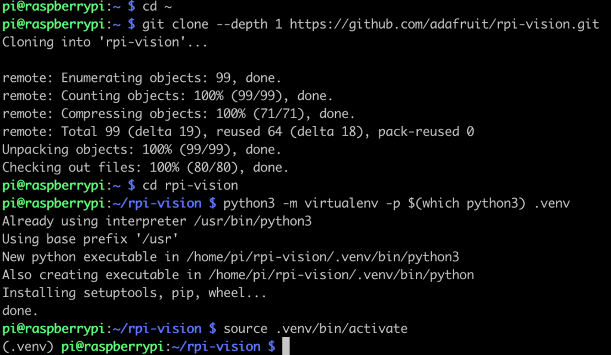
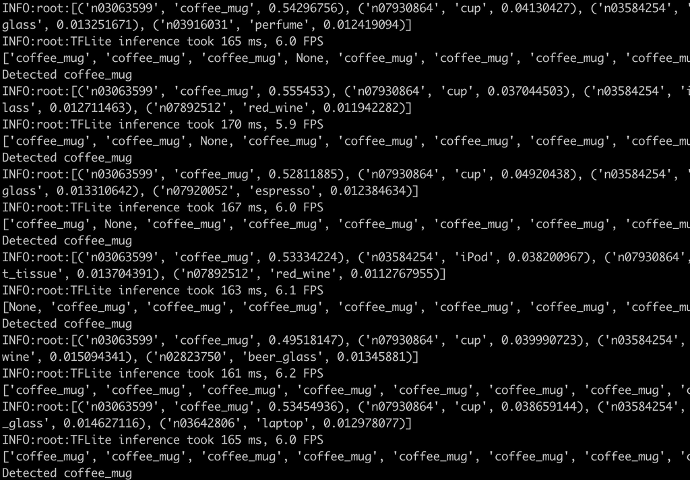
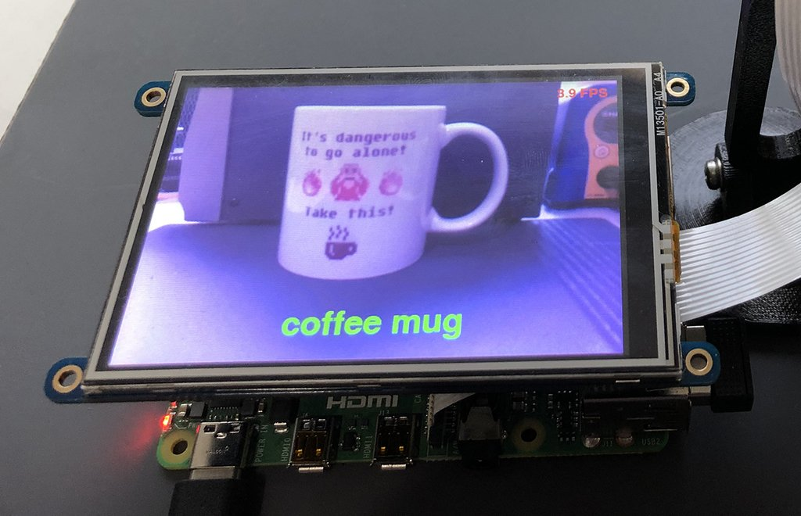
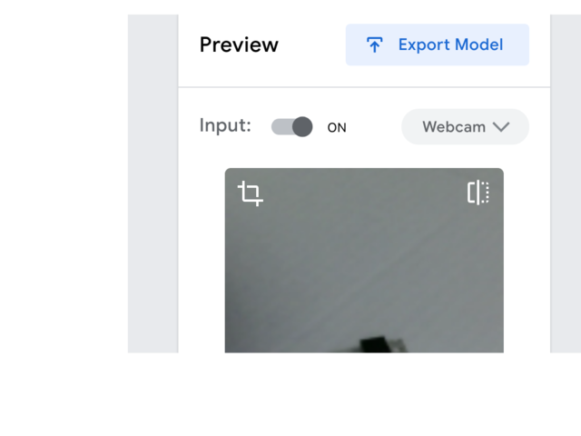
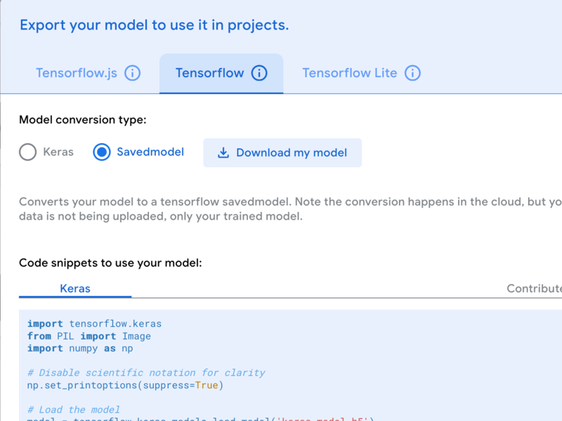

This tutorial is a step step instruction manual on how to:

1)  Set up a network to connect your computer to a Raspberry pi,

2)  Connecting a Camera to your Raspberry Pi

3)  Connect a Raspberry Pi (a single board computer) to a BrainCraft Hat
    > (a microprocessor that adds a screen, audio, and microphone to
    > your raspberry Pi) and a fan (for cooling it down when it's
    > overthinking), and

4)  Configuring Raspberry Pi to do Machine Learning

5)  Adding a simple AI model to your raspberry PI for you to use in your
    > conservation technology projects.

**[Materials Needed](#materials-needed) 2**

**[Setting up a Network Between your Computer and a Raspberry
PI](#setting-up-a-network-between-your-computer-and-a-raspberry-pi) 2**

> [2.1 Installing an Operating System on your Raspberry
> PI](#installing-an-operating-system-on-your-raspberry-pi) 2
>
> [2.2 Adding Network Information on SD Card and Operating
> System](#adding-network-information-on-sd-card-and-operating-system) 3
>
> [2.3 Connecting your Raspberry Pi to the
> Internet](#connecting-your-raspberry-pi-to-the-internet) 4
>
> [2.4 Seeing and Controlling your Raspberry Pi's Desktop through your
> Laptop](#seeing-and-controlling-your-raspberry-pis-desktop-through-your-laptop)
> 5

**[Setting Up The Camera](#setting-up-the-camera) 6**

> [Introduction](#introduction) 6
>
> [Connect the Camera:](#connect-the-camera) 6
>
> [Enabling, Testing, and
> Troubleshooting](#enabling-testing-and-troubleshooting) 7

**[4. Connecting and Configuring Braincraft
HAT](#connecting-and-configuring-braincraft-hat) 8**

> [Introduction](#introduction-1) 8
>
> [Braincraft HAT Hardware Install](#braincraft-hat-hardware-install) 8
>
> [Fan](#fan) 9
>
> [Braincraft HAT](#braincraft-hat) 9
>
> [Blinka Setup](#blinka-setup) 9
>
> [Fan Service Setup](#fan-service-setup) 10
>
> [Display Module Setup](#display-module-setup) 13
>
> [Interacting with your Camera and BrainCraft HAT using
> Python](#interacting-with-your-camera-and-braincraft-hat-using-python)
> 14
>
> [Joystick and Button test](#joystick-and-button-test) 15
>
> [DotStar LEDs Test](#dotstar-leds-test) 16

**[5. Tensorflow Setup](#tensorflow-setup) 17**

**[6. Adding a simple machine learning model to your raspberry PI for
you to use in your conservation technology
projects.](#adding-a-simple-machine-learning-model-to-your-raspberry-pi-for-you-to-use-in-your-conservation-technology-projects.)
21**

## 1. Materials Needed

> **1x per team**

-   [[Raspberry Pi 4]{.ul}](https://www.adafruit.com/product/4296)

-   [[Raspberry Pi Camera
    > Board]{.ul}](https://www.adafruit.com/product/3099)

-   [[Camera extension
    > cable]{.ul}](https://www.adafruit.com/product/1731)

-   [[BrainCraft Hat]{.ul}](https://www.adafruit.com/product/4374)

-   [[Power supply compatible with Raspberry Pi
    > 4]{.ul}](https://www.adafruit.com/product/4298)

-   [[microSD card with adapter 16
    > GB]{.ul}](https://www.adafruit.com/product/2693)

-   [[Micro SD Card Reader]{.ul}](https://www.adafruit.com/product/939)

-   [[USB C to USB A
    > Adapter]{.ul}](https://www.adafruit.com/product/5030)

-   [[Raspberry Pi Case]{.ul}](https://www.adafruit.com/product/4301)

-   [[Camera Case]{.ul}](https://www.adafruit.com/product/3253)

-   [[Tripod]{.ul}](https://www.amazon.com/dp/B08C53F6CD) (optional)

> **1 Total**

-   [[microSD card to USB C
    > Adapter]{.ul}](https://www.amazon.com.mx/Sandisk-Extreme-Type-C-Negro-Plata/dp/B078JTMDWH/ref=asc_df_B078JTMDWH/?tag=gledskshopmx-20&linkCode=df0&hvadid=360919188123&hvpos=&hvnetw=g&hvrand=4421291350922203231&hvpone=&hvptwo=&hvqmt=&hvdev=c&hvdvcmdl=&hvlocint=&hvlocphy=1010043&hvtargid=pla-440234556449&psc=1)

## 2. Setting up a Network Between your Computer and a Raspberry PI

*Goal: In this section we are installing an operating system on our
Raspberry Pi, connecting to our internet network, and making sure that
our laptop can easily communicate with the Raspberry Pi.*

**Required Equipment:**

-   Computer

-   microSD card 16GB

-   Adaptor for microSD to your computer (usb-C port)

-   [[Raspberry Pi 4]{.ul}](https://www.adafruit.com/product/4296)

### 2.1 Installing an Operating System on your Raspberry PI

-   Take your SD card out of the package, or use one that you have close
    > by but make sure that it's empty because we're going to completely
    > overwrite it. Connect your SD card to your computer using your
    > microSD adapter for USB-C (if you're using a newer Mac).

-   Visit:

    -   [[https://www.raspberrypi.org/software/]{.ul}](https://www.raspberrypi.org/software/)

    -   Click on the "Download for MacOs" button and go through the
        > steps to install on your computer. If the install is
        > successful you should be able to see this:

{width="3.8802088801399823in"
height="2.543977471566054in"}

-   Choose the latest operating system.

-   To make sure that you are mounting the image of this operating
    > system on your RasperyPi(not your computer - THE SD CARD), plug
    > and unplug the SD card so that you can see it appear and disappear
    > on the storage section of the Raspberry Pi Imager. That way you'll
    > make sure that you are installing the operating system in the
    > correct place.

-   Click "WRITE" - this will install the latest operating system on
    > your SD card.

### 2.2 Adding Network Information on SD Card and Operating System

Useful links:

1.  [[https://learn.adafruit.com/raspberry-pi-zero-creation/text-file-editing]{.ul}](https://learn.adafruit.com/raspberry-pi-zero-creation/text-file-editing)

2.  [[https://spin.atomicobject.com/2019/06/09/raspberry-pi-laptop-display/]{.ul}](https://spin.atomicobject.com/2019/06/09/raspberry-pi-laptop-display/)

Follow the instructions in the first link above. We paste some code
below to support the text in that link, which should be mostly what you
need. Right now you are not doing anything on your Raspberry PI *yet*.
You are adding and making changes to files inside the SD card so that
you can connect to the internet. After we've done that we'll move the SD
card to the Raspberry Pi.

First lets access the places in the SD that we'll edit

+-----------------------------------------------------------------------+
| \$ cd /Volumes                                                        |
|                                                                       |
| \<\< we're going to choose the boot partition. You can tell which one |
| it is, because if plug and unplug your sd card the boot inside        |
| /Volumes should appear and disappear \>\>\                            |
| \$ cd /boot                                                           |
+=======================================================================+
+-----------------------------------------------------------------------+

Now we create ther wpa_supplicant.conf file that is mentioned in the
link. We use this using "touch"r

+-----------------------------------------------------------------------+
| \$ touch wpa_supplicant.conf\                                         |
| \$ ls                                                                 |
|                                                                       |
| \<\< we use ls to list out the files inside a folder. The conf file   |
| should now appear in your list of files \>\>                          |
+=======================================================================+
+-----------------------------------------------------------------------+

One we see the file we're going to edit the wpa file with the
information of our network. We do this by going in the SD card and
either using "vim" or "nano" to edit the file you just created. Below we
use nano to open the file:

  -----------------------------------------------------------------------
  \$ nano wpa_supplicant.conf
  -----------------------------------------------------------------------

  -----------------------------------------------------------------------

Copy and paste this code into that file, and edit it with the
information of your network. Don't forget to save the file after you
close it!

  -----------------------------------------------------------------------
  ctrl_interface=DIR=/var/run/wpa_supplicant GROUP=netdev\
  update_config=1\
  country=US\
  \
  network={\
  ssid=\"YOURSSID\"\
  psk=\"YOURPASSWORD\"\
  scan_ssid=1\
  }
  -----------------------------------------------------------------------

  -----------------------------------------------------------------------

Note that there are no spaces in between the "=". If you're outside of
the US change your country code.

Finally, enable SSH by creating an empty file named ssh (this will just
be an empty file for now):

  -----------------------------------------------------------------------
  \$ touch ssh
  -----------------------------------------------------------------------

  -----------------------------------------------------------------------

Check that all your files are there. The important ones are the
wpa_supplicant and the ssh files, and then *safely remove the SD card
from your computer (don't just unplug it).*

### 2.3 Connecting your Raspberry Pi to the Internet

*NOTE: In a classroom with many students we must turn the Pis one by one
and see their different IP addresses.*

**Required Downloads:**

-   [[https://nmap.org/download.html]{.ul}](https://nmap.org/download.html)

First install nmap on your computer. nmap is a network sniffing tool for
understanding network traffic. The goal is to identify the IP address of
our raspberry PI.

1.  First identify your own IP address. You can do this by holding on
    > the "option" button on your Mac keyboard while clicking on the
    > "wifi" button on your top menu. Write down the IP address that
    > your computer is using. The first time you run nmap from your
    > terminal make sure you do it without turning on your PI.

+-----------------------------------------------------------------------+
| nmap -sP \<\<YOUR IP ADDRESS>\>/24                                    |
|                                                                       |
| nmap -sP 192.168.1.79/24                                              |
+=======================================================================+
+-----------------------------------------------------------------------+

2.  Now that you've seen the IP addresses that are in your network, turn
    > on your PI and see if there is *a new IP address.* The new IP
    > address will be the IP address that your PI is using. Note, if you
    > don't see a new IP address you might have to plug the SD card back
    > on your computer and make sure that you've done all the steps in
    > the previous section correctly. Once you identify it you're going
    > to want to ssh into it from your Mac's terminal:

+-----------------------------------------------------------------------+
| ssh pi@\<YOURIPNETWORK>                                               |
|                                                                       |
| ssh pi\@192.168.1.90                                                  |
+=======================================================================+
+-----------------------------------------------------------------------+

3.  If you don't find your raspberry address here, or if it doesn't work
    > do:

  -----------------------------------------------------------------------
  ssh pi\@raspberrypi.local
  -----------------------------------------------------------------------

  -----------------------------------------------------------------------

a.  Say "yes" and connect to the pi using the default password
    > "raspberry". If you are able to ssh then you're connected to the
    > internet!

b.  Before you move forward, if this works, ping this ip address.

  -----------------------------------------------------------------------
  ping raspberrypi.local
  -----------------------------------------------------------------------

  -----------------------------------------------------------------------

c.  Copy and paste the IP address.

```{=html}
<!-- -->
```
4.  Say "yes" and connect to the pi using the default password
    > "raspberry". If you are able to ssh then you're connected to the
    > internet!

5.  From the terminal (once you've sshd in), change your PI's password
    > by using the instructions
    > [[here]{.ul}](https://www.raspberrypi-spy.co.uk/2012/10/how-to-change-raspberry-pi-password/).

6.  ALSO change your hostname (this is specially important if you're
    > working with a group of students that's using many raspberry pis).

    a.  [[https://www.tomshardware.com/how-to/raspberry-pi-change-hostname]{.ul}](https://www.tomshardware.com/how-to/raspberry-pi-change-hostname)

7.  Write down your PI's \[IP address\] AND \[your new password\]
    > somewhere safe, we're going to use them later on in the tutorial.

### 2.4 Seeing and Controlling your Raspberry Pi's Desktop through your Laptop

**Useful links:**

-   [[https://spin.atomicobject.com/2019/06/09/raspberry-pi-laptop-display]{.ul}](https://spin.atomicobject.com/2019/06/09/raspberry-pi-laptop-display)

-   [[https://magpi.raspberrypi.org/articles/vnc-raspberry-pi]{.ul}](https://magpi.raspberrypi.org/articles/vnc-raspberry-pi)

Once you've sshd into your PI install VNC on your PI by following the
steps here:

-   [[https://www.raspberrypi.org/documentation/remote-access/vnc/]{.ul}](https://www.raspberrypi.org/documentation/remote-access/vnc/)

  -----------------------------------------------------------------------
  pi\@raspberrypi:\~ \$ sudo apt update\
  pi\@raspberrypi:\~ \$ sudo apt install realvnc-vnc-server
  realvnc-vnc-viewer
  -----------------------------------------------------------------------

  -----------------------------------------------------------------------

After installing the VNC server, you have to enable it.

  -----------------------------------------------------------------------
  pi\@raspberrypi:\~ \$ sudo raspi-config
  -----------------------------------------------------------------------

  -----------------------------------------------------------------------

A pop-up will appear → navigate to "Interface/ing Options" → navigate to
"P3 VNC" → Select "Yes" → navigate down and select "Finish".

Now we install VNC on our computer by [[downloading it from
here]{.ul}](https://www.realvnc.com/en/connect/download/viewer/).

To connect to your Raspberry Pi's desktop launch the VNC viewer and type
down the IP address of your PI as the VNC server address. Use username
"pi" and the password you changed above. You initially might have some
trouble connecting and you'll get an error that might say "*Cannot
Currently Show the Desktop*". If so, follow the first instruction
[[here]{.ul}](https://www.tomshardware.com/how-to/fix-cannot-currently-show-desktop-error-raspberry-pi)
on how to change the resolution of the desktop. Try again. If it works
... hooray! If not, keep trying until you figure out what the problem
is. Awesome! We're ready to begin the actual fun part.

## 3. Setting Up The Camera{width="3.3906255468066493in" height="2.3980074365704285in"}

### Introduction

This section will walk through how to connect the Raspberry Pi Camera
Module to your Raspberry Pi to take pictures and record video. Raspberry
Pi's have a port dedicated to connecting the camera module.

Before plugging in or unplugging anything always ensure your Raspberry
Pi is off and disconnected from power.

### Connect the Camera:

1.  Ensure Pi is turned off

2.  Locate the Camera Module
    > port{width="3.7713877952755905in"
    > height="2.3958333333333335in"}

3.  Gently pull up on the edges of the port's plastic clip

4.  Insert the Camera Module ribbon cable; make sure the blue side of
    > the cable is facing the ethernet ports.

5.  Push the black plastic clip back into place firmly, but make sure
    > you're pressing it down vertically.

6.  Place the Camera board into the protective plastic case.

### Enabling, Testing, and Troubleshooting

1.  Startup your Raspberry Pi.

2.  Connect with VNC Viewer as detailed previously

3.  Go to the main menu > Preferences > Raspberry Pi Configuration tool

4.  Select the Interfaces tab and ensure that the camera is enabled

5.  Reboot your Raspberry Pi by going to main menu > Logout > Reboot

Once the Pi has rebooted, reconnect using VNC Viewer. Open up a terminal
window using VNC Viewer and type this command that should take a still
picture and save it to the Desktop.

  -----------------------------------------------------------------------
  raspistill -o Desktop/image.jpg
  -----------------------------------------------------------------------

  -----------------------------------------------------------------------

If you see an image appear on your Pi Desktop it means that your camera
is connected correctly. Congratulations!

If you receive the following error it means that your camera is not
connected properly.

  -----------------------------------------------------------------------
  \$ raspistill -o Desktop/image.jpg\
  mmal: Cannot read camera info, keeping the defaults for OV5647\
  mmal: mmal_vc_component_create: failed to create component
  \'vc.ril.camera\' (1:ENOMEM)\
  mmal: mmal_component_create_core: could not create component
  \'vc.ril.camera\' (1)\
  mmal: Failed to create camera component\
  mmal: main: Failed to create camera component\
  mmal: Camera is not detected. Please check carefully the camera module
  is installed correctly
  -----------------------------------------------------------------------

  -----------------------------------------------------------------------

To trouble shoot, shutdown your Raspberry Pi, unplug the camera, and
reconnect. Ensure it is facing the right direction, it is seated at the
bottom of the connective housing, it is not crooked, and the black clip
is pushed all the way down.

Also double check on the camera board that the small ribbon cable below
the lens is connected to the board evenly. Do not attempt to unplug if
it is already connected. This is a very delicate connector and should be
treated with the utmost care.

After following these troubleshooting steps, plug in your Raspberry Pi
and try to run the command above to take a photo again. The camera
connection can be finicky, it may take a couple tries to get it
connected the right way.

## 4. Connecting and Configuring Braincraft HAT

### Introduction

The idea behind the Adafruit BrainCraft HAT is that you'd be able to
"craft brains" for Machine Learning on the EDGE (Edge is a way to refer
to small computers like phones or other smaller hardware), with
Microcontrollers & Microcomputers. This HAT will let you build a wide
range of audio/video AI projects while also allowing easy plug-in of
sensors and robotics!

As a part of this section we will also connect the controllable mini fan
to the bottom of the hat to keep your Pi cool while doing intense AI
inference calculations. Most importantly, there's an On/Off switch that
will completely disable the audio codec, so that when it\'s off, there's
no way it\'s listening to you.

We're not going to go in depth on each component, [[but if you want to
learn more about the board and its pinouts, check this
out.]{.ul}](https://learn.adafruit.com/adafruit-braincraft-hat-easy-machine-learning-for-raspberry-pi/pinouts)
The basic features are as follows:

-   1.54\" IPS TFT display with 240x240 resolution that can show text or
    > video

-   Stereo speaker ports for audio playback - either text-to-speech,
    > alerts or for creating a voice assistant.

-   Stereo headphone out for audio playback through a stereo system,
    > headphones, or powered speakers.

-   Stereo microphone input - perfect for making your very own smart
    > home assistants

-   Two 3-pin JST STEMMA connectors that can be used to connect more
    > buttons, a relay, or even some NeoPixels!

-   STEMMA QT plug-and-play I2C port, can be used with any I2C STEMMA QT
    > boards, or can be used to connect to Grove I2C devices with an
    > adapter cable.

-   5-Way Joystick + Button for user interface and control.

-   Three RGB DotStar LEDs for colorful LED feedback.

### Braincraft HAT Hardware Install

You will install the Braincraft HAT in two parts, the first is
connecting the fan and then you will connect the HAT itself.

#### Fan

Carefully position your Braincraft HAT screen side down. Take your fan
from its packaging and connect the wires into the small connector that
says FAN: P4. The Red wire should face the large black plastic
connector. Once this is connected, take off the orange hole protector
stickers from the board and position your fan on the middle of the board
aligning the holes. Position the wire so it is not pinched under the
fan, and carefully attach the screws firmly, but not too tight. You
should be using the screws that *do not* come with the small nuts (don't
use the nuts).

{width="4.766244531933508in"
height="3.574682852143482in"}

#### Braincraft HAT

Flip the board fan side down and carefully press the rubber joystick
cover over the small joystick to the right of the screen. Once you have
done this, carefully align the hat's plastic connector over the pins on
your board so the hat is covering the majority of the Raspberry Pi.
Firmly press down to make sure the components are connected.
Congratulations, your Braincraft board and fan are installed!

### Blinka Setup

Blinka is a CircuitPython (python meant to be run on microcontrollers)
library compatibility layer. It allows many of the libraries that were
written for CircuitPython to run on CPython for Linux. To learn more
about Blinka, you can check out the [[CircuitPython on Linux and
Raspberry
Pi]{.ul}](https://learn.adafruit.com/circuitpython-on-raspberrypi-linux)
guide. We will need to install it to get the Braincraft Components up
and running.

SSH into your Raspberry Pi or access via VNC viewer and open a terminal.
Execute the following series of commands.

  -----------------------------------------------------------------------
  pip3 install setuptools \--upgrade
  -----------------------------------------------------------------------

  -----------------------------------------------------------------------

Next input the following commands. Note these are several commands that
will run one after another. When it asks you if you want to reboot,
choose yes.

  ---------------------------------------------------------------------------------------------------
  cd \~\
  sudo pip3 install \--upgrade adafruit-python-shell\
  wget
  https://raw.githubusercontent.com/adafruit/Raspberry-Pi-Installer-Scripts/master/raspi-blinka.py\
  sudo python3 raspi-blinka.py
  ---------------------------------------------------------------------------------------------------

  ---------------------------------------------------------------------------------------------------

Once it reboots, there are a couple CircuitPython libraries to install
for the BrainCraft HAT.

The DotStar library is for controlling the 3 on-board DotStar LEDs and
the Motor library is for testing out the GPIO pins. Install it using pip
using the command below.

  -----------------------------------------------------------------------
  pip3 install \--upgrade adafruit-circuitpython-dotstar
  adafruit-circuitpython-motor adafruit-circuitpython-bmp280
  -----------------------------------------------------------------------

  -----------------------------------------------------------------------

### Fan Service Setup

There is a really simple fan service that will control the onboard fan
you just installed. The reason we have it set up as a service instead of
keeping the fan on all the time is so that it doesn\'t drain too much
power from the Pi during the initial power on.

The fan service basically controls turning GPIO 4 on at startup, which
is what the fan is connected to. Installing the fan service is really
simple and we have a script for doing that.

To install, ssh in or access using VNC Viewer and open a terminal
window. Input the following command:

  -----------------------------------------------------------------------
  sudo raspi-config
  -----------------------------------------------------------------------

  -----------------------------------------------------------------------

Select Performance Options

{width="4.2725415573053365in"
height="2.713542213473316in"}

Select Fan

{width="4.226860236220473in"
height="2.5361154855643044in"}

Select Yes

{width="4.265625546806649in"
height="2.5808180227471564in"}

{width="4.307292213473316in"
height="2.6060279965004374in"}

And make sure you put down GPIO pin 4 for the fan

{width="4.3587106299212595in"
height="2.609032152230971in"}

You can customize the fan temperature setting. **For testing, put it on
60.**

{width="4.446293744531934in"
height="2.6614588801399823in"}

To see if it's connected correctly, run a stress test. The following
command will stress test the CPU causing the Pi to heat up. The fan
should turn on at 60 degrees C.

  -----------------------------------------------------------------------
  sudo apt-get install stress\
  while true; do vcgencmd measure_clock arm; vcgencmd measure_temp; sleep
  10; done& stress -c 4 -t 900s
  -----------------------------------------------------------------------

  -----------------------------------------------------------------------

If the fan works as expected, reboot your pi using sudo reboot to end
the stress test. When it is rebooted follow the instructions above and
switch the temperature to 80 degrees.

If the fan does not switch on as expected, try reconnecting the wire.

### Display Module Setup

For some purposes you can setup the display using pure Python, which is
probably easier, but for our purposes we will need to install using a
kernel module. [[You can learn more about kernel modules here if you
want.]{.ul}](https://en.wikipedia.org/wiki/Loadable_kernel_module)

To setup run the following script while you are ssh'd in or on a
terminal opened through VNC Viewer.

  -----------------------------------------------------------------------
  cd \~\
  sudo pip3 install \--upgrade adafruit-python-shell click\
  sudo apt-get install -y git\
  git clone
  https://github.com/adafruit/Raspberry-Pi-Installer-Scripts.git\
  cd Raspberry-Pi-Installer-Scripts\
  sudo python3 adafruit-pitft.py \--display=st7789_240x240 \--rotation=0
  \--install-type=fbcp
  -----------------------------------------------------------------------

  -----------------------------------------------------------------------

When you are asked to reboot, reboot.
{width="6.5in" height="2.875in"}

If your display module has a bunch of lines running through it, [[check
out this page to
troubleshoot.]{.ul}](https://learn.adafruit.com/adafruit-braincraft-hat-easy-machine-learning-for-raspberry-pi/kernel-module-troubleshooting)

Test out your camera by running:

  -----------------------------------------------------------------------
  sudo pip3 install picamera\
  raspistill -t 0
  -----------------------------------------------------------------------

  -----------------------------------------------------------------------

If it is working you should see what the camera is viewing on your
display.

### {width="4.854166666666667in" height="3.6406255468066493in"}

### Interacting with your Camera and BrainCraft HAT using Python

At this point, you should have just about everything already set up.

Besides the display, audio, and fan, this board has quite a few other
useful features on it that can be controlled through Python. We\'ll go
through those and how to control them in Python.

#### Joystick and Button test

The 5-way Joystick and button uses digitalio and each uses a separate
GPIO, so they\'re really simple to control. Here\'s a script that will
setup the GPIOs, Create Internal Pullups, and then print out the value
to the terminal.

What you want to do is create a new python file and paste this script
into the file. To do this we use nano, which is a simple text editor
that you can access through your terminal. To create a new file you
input nano filename which will then pull up an empty file with the name
you chose. In a terminal access your Pi via ssh, and input the
following:

  -----------------------------------------------------------------------
  nano button_test.py
  -----------------------------------------------------------------------

  -----------------------------------------------------------------------

Paste the following script into the file and save and exit using the
commands listed in the terminal.

  -----------------------------------------------------------------------
  import time\
  import board\
  from digitalio import DigitalInOut, Direction, Pull\
  \
  BUTTON_PIN = board.D17\
  JOYDOWN_PIN = board.D27\
  JOYLEFT_PIN = board.D22\
  JOYUP_PIN = board.D23\
  JOYRIGHT_PIN = board.D24\
  JOYSELECT_PIN = board.D16\
  \
  buttons = \[BUTTON_PIN, JOYUP_PIN, JOYDOWN_PIN,\
  JOYLEFT_PIN, JOYRIGHT_PIN, JOYSELECT_PIN\]\
  for i,pin in enumerate(buttons):\
  buttons\[i\] = DigitalInOut(pin)\
  buttons\[i\].direction = Direction.INPUT\
  buttons\[i\].pull = Pull.UP\
  button, joyup, joydown, joyleft, joyright, joyselect = buttons\
  \
  while True:\
  if not button.value:\
  print(\"Button pressed\")\
  if not joyup.value:\
  print(\"Joystick up\")\
  if not joydown.value:\
  print(\"Joystick down\")\
  if not joyleft.value:\
  print(\"Joystick left\")\
  if not joyright.value:\
  print(\"Joystick right\")\
  if not joyselect.value:\
  print(\"Joystick select\")\
  \
  time.sleep(0.01)
  -----------------------------------------------------------------------

  -----------------------------------------------------------------------

Once you have done this run this Python file using

  -----------------------------------------------------------------------
  python button_test.py
  -----------------------------------------------------------------------

  -----------------------------------------------------------------------

Now try moving the joystick and press the button and you should see it
print out what you\'re pressing.

#### DotStar LEDs Test

Using the same method explained above, save this script as
dotstar_test.py

  -----------------------------------------------------------------------
  import time\
  import board\
  import adafruit_dotstar\
  \
  DOTSTAR_DATA = board.D5\
  DOTSTAR_CLOCK = board.D6\
  \
  dots = adafruit_dotstar.DotStar(DOTSTAR_CLOCK, DOTSTAR_DATA, 3,
  brightness=0.2)\
  \
  def wheel(pos):\
  \# Input a value 0 to 255 to get a color value.\
  \# The colours are a transition r - g - b - back to r.\
  if pos \< 0 or pos \> 255:\
  return (0, 0, 0)\
  if pos \< 85:\
  return (255 - pos \* 3, pos \* 3, 0)\
  if pos \< 170:\
  pos -= 85\
  return (0, 255 - pos \* 3, pos \* 3)\
  pos -= 170\
  return (pos \* 3, 0, 255 - pos \* 3)\
  \
  while True:\
  for j in range(255):\
  for i in range(3):\
  rc_index = (i \* 256 // 3) + j \* 5\
  dots\[i\] = wheel(rc_index & 255)\
  dots.show()\
  time.sleep(0.01)
  -----------------------------------------------------------------------

  -----------------------------------------------------------------------

Run by entering

  -----------------------------------------------------------------------
  python dotstar_test.py
  -----------------------------------------------------------------------

  -----------------------------------------------------------------------

The DotStar LEDs should start color-cycling in a rainbow.

## 5. Tensorflow Setup

[[You can access the tutorial most of this was copied from
here]{.ul}](https://learn.adafruit.com/running-tensorflow-lite-on-the-raspberry-pi-4/tensorflow-lite-2-setup)

*NOTE:*

-   You might have to run this two times before getting the setup right.

-   You should run all these commands while ssh'd into your Raspberry
    > Pi's terminal.

There are a few packages that TensorFlow requires that need to be
installed:

  -----------------------------------------------------------------------
  sudo apt-get install -y libatlas-base-dev libhdf5-dev libc-ares-dev
  libeigen3-dev build-essential libsdl-ttf2.0-0 python-pygame festival
  python3-h5py
  -----------------------------------------------------------------------

  -----------------------------------------------------------------------

Now you have to create a virtual Environment. There are a few dependency
requirements to install TensorFlow inside the Python Environment:

  -----------------------------------------------------------------------
  pip3 install virtualenv Pillow numpy pygame
  -----------------------------------------------------------------------

  -----------------------------------------------------------------------

Install rpi-vision. Now to install an Adafruit fork of a program
originally written by Leigh Johnson that uses the MobileNet V2 model to
detect objects. This part will take a few minutes to complete.

  -----------------------------------------------------------------------
  cd \~\
  git clone \--depth 1 https://github.com/adafruit/rpi-vision.git\
  cd rpi-vision\
  python3 -m virtualenv -p \$(which python3) .venv\
  source .venv/bin/activate
  -----------------------------------------------------------------------

  -----------------------------------------------------------------------

Install TensorFlow 2.x. You should now be inside a virtual environment.
You can tell by the (.venv) on the left side of the command prompt.
While in the virtual environment, you may download and install
Tensorflow 2.3.1{width="6.5in"
height="3.7777777777777777in"}

+-----------------------------------------------------------------------+
| wget                                                                  |
| [                                                                     |
| [https://raw.githubusercontent.com/PINTO0309/Tensorflow-bin/main/prev |
| ious_versions/download_tensorflow-2.3.1-cp37-none-linux_armv7l.sh]{.u |
| l}](https://raw.githubusercontent.com/PINTO0309/Tensorflow-bin/main/p |
| revious_versions/download_tensorflow-2.3.1-cp37-none-linux_armv7l.sh) |
|                                                                       |
| chmod a+x ./download_tensorflow-2.3.1-cp37-none-linux_armv7l.sh       |
|                                                                       |
| ./download_tensorflow-2.3.1-cp37-none-linux_armv7l.sh                 |
|                                                                       |
| pip3 install \--upgrade setuptools                                    |
+=======================================================================+
+-----------------------------------------------------------------------+

  -----------------------------------------------------------------------
  pip3 install ./tensorflow-2.3.1-cp37-none-linux_armv7l.whl\
  pip3 install -e .
  -----------------------------------------------------------------------

  -----------------------------------------------------------------------

{width="6.5in"
height="4.694444444444445in"}

After this, go ahead and reboot the Pi.

  -----------------------------------------------------------------------
  sudo reboot
  -----------------------------------------------------------------------

  -----------------------------------------------------------------------

\*\*\* AFTER REBOOT MAKE SURE YOU GET INTO THE PI AGAIN \*\*\*

Running the Graphic Labeling Demo. Finally you are ready to run the
detection software. First you want to run as **root** so that Python can
access the Frame Buffer of the display.

  -----------------------------------------------------------------------
  sudo bash
  -----------------------------------------------------------------------

  -----------------------------------------------------------------------

Then activate the virtual environment again:

  -----------------------------------------------------------------------
  cd rpi-vision && . .venv/bin/activate
  -----------------------------------------------------------------------

  -----------------------------------------------------------------------

To run a program that will display the object it sees on screen type in
the following:

  -----------------------------------------------------------------------
  python3 tests/pitft_labeled_output.py \--tflite
  -----------------------------------------------------------------------

  -----------------------------------------------------------------------

You should see a bunch of text scrolling in your SSH window.

{width="6.5in"
height="4.527777777777778in"}

Now start holding up various items in front of the camera and it should
display what it thinks it sees, which isn\'t actually what the item may
be. Some items that it\'s pretty good about identifying are coffee mugs
and animals.

{width="6.5in"
height="4.194444444444445in"}

## 6. Adding a simple machine learning model to your raspberry PI for you to use in your conservation technology projects.

**Useful Links:**

[[https://teachablemachine.withgoogle.com/train]{.ul}](https://teachablemachine.withgoogle.com/train)

We're going to use Teachable Machine to train and use a machine learning
model for conservation technology projects. Teachable machine is a
web-based tool that makes creating machine learning models fast, easy
and accessible to everyone. It's for educators, artists, students,
innovators, makers of all kinds. **No prerequisite machine learning
knowledge or experience is required.**

First we're going to train our ML model. Visit:

[[https://teachablemachine.withgoogle.com/train]{.ul}](https://teachablemachine.withgoogle.com/train)

Choose:

-   Image project → Standard Image model

You can either use your webcam or upload pictures to train your ML
model. Our suggestion is to start with an easy model first so that you
can get a feel for it. Our suggestion is to begin by creating three
classes. In the example below:

-   Class 1: I grabbed about 10 water bottles that I had at home and I
    > took over 300 samples (just clicking and holding the button),
    > Class 2: I grabbed other things that were not water bottles and
    > took pictures of them, and Cass 3: I took pictures of empty
    > backgrounds. Having 3 classes allows the ML to "train" using
    > bottles, other objects and empty backgrounds. You can pass many
    > more classes to be more specific. The more specific you are with
    > the photos (data) you're passing, the more specific your ML model
    > will be as well.

-   Hints:

    -   As you take (or chose) pictures make sure you do so with
        > different backgrounds. Changes in light and changes in
        > background -while maintaining the focus on the object that
        > you're labeling fixed - will allow us to have better training
        > data.

{width="4.938584864391951in"
height="3.260731627296588in"}

After you've created your classes, click on "Training". It'll take a
little bit for the model to train. After that's completed, click on
"Export Mode" and follow the instructions here:

[[https://learn.adafruit.com/teachable-machine-raspberry-pi-tensorflow-camera/transferring-to-the-pi]{.ul}](https://learn.adafruit.com/teachable-machine-raspberry-pi-tensorflow-camera/transferring-to-the-pi)

The first step is to export your shiny new model in **SavedModel**
format. This makes it easy to transfer all of the files needed to the
Pi, since it comes in a zip file.

{width="4.125in"
height="2.5024464129483817in"}

In the dialog that appears, choose **TensorFlow** and be sure the
**SavedModel** button is selected, as shown below. Then, click
**Download my model**. After a minute or two, your browser will save a
converted_savedmodel.zip
file.{width="4.395833333333333in"
height="3.2968755468066493in"}

Now we're running the model on the Pi. When you clicked the **Download
my model** button in the last step, your browser should have saved a
file called converted_savedmodel.zip. Now you need to place this on your
Raspberry Pi.

You can transfer the model to the Raspberry Pi using scp:

  -----------------------------------------------------------------------
  \$ scp \<\<PATH_TO_DOWNLOADS>\>/converted_savedmodel.zip
  pi\@raspberrypi.local:\~
  -----------------------------------------------------------------------

  -----------------------------------------------------------------------

**NOTE**: You might need to adjust the first path in the command above
to point to your Downloads folder.

Now, SSH to your Pi and run:

  -----------------------------------------------------------------------
  \$ cd rpi-vision\
  \$ sudo bash\
  \# source .venv/bin/activate\
  \# python3 tests/pitft_teachablemachine.py ../converted_savedmodel.zip
  -----------------------------------------------------------------------

  -----------------------------------------------------------------------

It will take some time to load the model into memory. During this time,
you\'ll see the BrainCraft logo appear on the display. Afterwards, point
your rpi camera and try it out!

**Challenges:**

1.  **How do you save the output of your model? For example, you want to
    > see only the predictions of "tiger images".**

2.  **Train your model to recognize audio**
